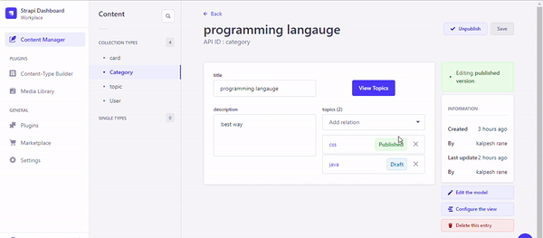

# Filter Button

## About



This package provides a custom field for Strapi that lets you add a filter button in no time.

Custom fields are supported since Strapi 4.4+ and offer powerful API to create highly customizable fields.

This plugin lets you view filtered data according to your configurations.


Installation

## Installation

To install this plugin, you need to add an NPM dependency to your Strapi application:
#### For NPM:
```bash
npm i filter-button
```
#### For Yarn:
```bash
yarn add filter-button
```

## Configuration 
#### create relations first for filter button to work
if relation is many to many then add boolean ```manyToMany:true``` in configuration

Add webpack.config.js file into src/admin and paste this content there.


```bash
'use strict';

/* eslint-disable no-unused-vars */
module.exports = (config, webpack) => {
  config.plugins.push(
    new webpack.DefinePlugin({
      CONTENT_TYPES: JSON.stringify(
        [
          {
            from: 'api::topic.topic', // collection where button will be added
            to: 'api::card.card', // which collection you want to filter
            filterBy: 'title', // field name by which you want to filter
            attributeName: 'viewCards', //attribute name added while adding button
            buttonTitle: 'View Cards', // title of button
          },
          {
            from: 'api::category.category',
            to: 'api::topic.topic',
            filterBy: 'title',
            attributeName: 'viewTopics',
            buttonTitle: 'View Topics',
          },
          {
            from: 'api::category.category', //adding multiple buttons for same collection
            to: 'api::card.card',
            filterBy: 'title',
            attributeName: 'viewCards',
            buttonTitle: 'View Cards',
          }
        ]
      ),
    })
  )
  return config;
};

```

### Then Run build: 
#### For NPM:
```bash
npm run bild
```
#### For Yarn:
```bash
yarn bild
```
## How To Use

1. Once all necessary configuration is done, create a elation between ```from``` and ```to``` collections.
2. Add button from custom fields
3. make sure ```attributeName``` is matching with configurations while creating custom field
